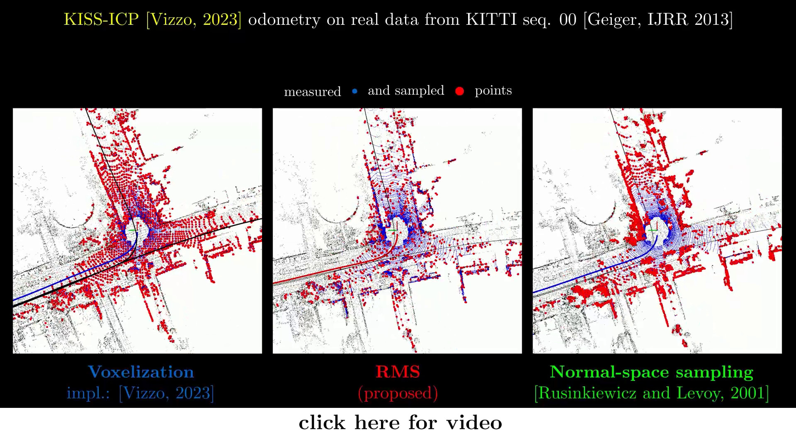
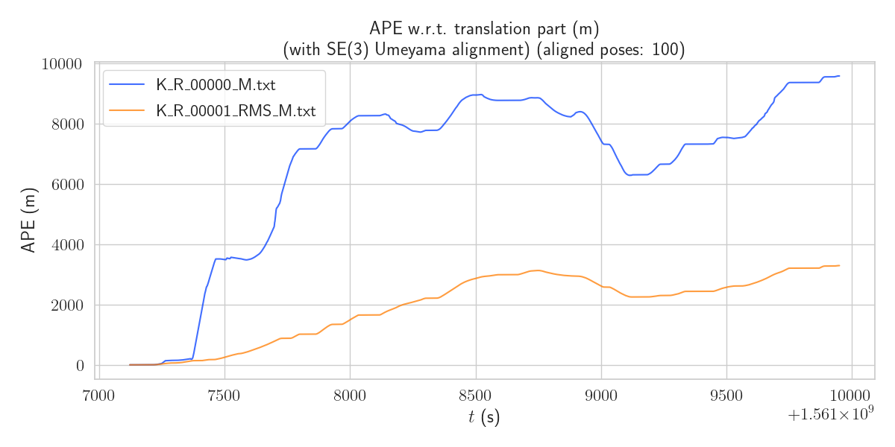

# RMS: Redundancy-Minimizing Point Cloud Sampling

[](https://www.youtube.com/watch?v=Y9ZlRrX1UBY)

  * quick sampling of 3D LiDAR point clouds
    * pipelines using **RMS** are fast (low latency) and accurate
  * designed for **real-time LiDAR-based** 6-DoF odometry/SLAM pipelines
    * both point-based (ICP-like) and feature-based (LOAM-like) methods 
  * **single parameter only: [lambda](https://github.com/ctu-mrs/RMS/blob/master/config/default.yaml)**
    * depends on the SLAM pipeline (and not the environment!)
    * tuned just once given your pipeline
  * deterministic (no data for learning needed) 
  * when is it not going to perform well (most probably):
    * the data have large orientation changes between two consecutive frames (tens of degrees)
    * under heavy noise

## Paper
Published in IEEE RA-L --- [pdf](https://arxiv.org/pdf/2312.07337.pdf).

## Code & How to

### Installation
1) Install prerequisities (`mrs_lib`, `PCL`):
```bash
  curl https://ctu-mrs.github.io/ppa-stable/add_ppa.sh | bash
  apt-get install ros-noetic-mrs-lib ros-noetic-pcl-ros
```
2) Clone and build via `catkin`
```bash
  cd <ROS1_WORKSPACE>/src
  git clone git@github.com:ctu-mrs/RMS.git
  catkin build
```

### How to use
1) Launch as nodelet:
```bash
roslaunch rms rms_nodelet.launch NS:=<NAMESPACE> points_in:=<POINTS IN TOPIC> points_out:=<POINTS OUT TOPIC>
```
2) Use as library in your code:
  - add `rms` among dependencies in `CMakeLists.txt` and `package.xml` and include the `<rms/rms.h>` header file
  - basic usage:
    ```cpp
    #include <rms/rms.h>
    ...
    // Initialize
    ros::NodeHandle nh;
    mrs_lib::ParamLoader param_loader(nh, "RMS");
    RMS rms = RMS(param_loader);
    ...
    // Use
    sensor_msgs::PointCloud2::Ptr msg = ...;
    rms->sample(msg); // 'msg' now contains sampled data
    ```
  - **example usage**: `RMSNodelet` implemented in [src/rms_nodelet.cpp](https://github.com/ctu-mrs/RMS/blob/master/src/rms_nodelet.cpp)

### Run it yourself
To complement the in-paper experiments, we offer comparison on the [MulRan](https://sites.google.com/view/mulran-pr/dataset) dataset by plugging its 3D LiDAR (Ouster OS1-64) data to the [KISS-ICP](https://github.com/PRBonn/kiss-icp) odometry.
For **ROS Noetic**, you may follow this workflow:

1) Click [here](todo) to download the `Sejong01` sequence rosbag.
2) Install RMS (see `Installation` above).
3) Clone, compile, and source our [KISS-ICP fork](https://github.com/petrapa6/kiss-icp) (minor changes made for ROS Noetic and launching).
```bash
cd ~/ROS1_WORKSPACE/src
git clone git@github.com:petrapa6/kiss-icp.git
cd kiss_icp
git checkout noetic
catkin build --this
source ~/ROS1_WORKSPACE/devel/setup.sh
```
4) Launch as:
```bash
  roslaunch kiss_icp odometry.launch bagfile:=<PATH TO ROSBAG> topic:=/mulran/velo/pointclouds use_RMS:=[true | false]
```

[**Results for the `Sejong01` experiment here.**](https://github.com/ctu-mrs/RMS/blob/master/example/sejong01.md).
APE of the experiment (voxelization in blue, RMS in orange):



## How to cite
```tex
@article{petracek2024rms,
  author  = {Petracek, Pavel and Alexis, Kostas and Saska, Martin},
  title   = {{RMS: Redundancy-Minimizing Point Cloud Sampling for Real-Time Pose Estimation}},
  journal = {IEEE Robotics and Automation Letters},
  year    = {2024},
  volume  = {9},
  number  = {6},
  pages   = {5230--5237},
  doi     = {10.1109/LRA.2024.3389820}
}
```

## Acknowledgment
This work was supported
- by CTU grant no. SGS23/177/OHK3/3T/13,
- by the Czech Science Foundation under research project No. 23-06162M,
- by the European Union under the project Robotics and advanced industrial production (reg. no. CZ.02.01.01/00/22_008/0004590), and
- by the Research Council of Norway Award NO-321435.
