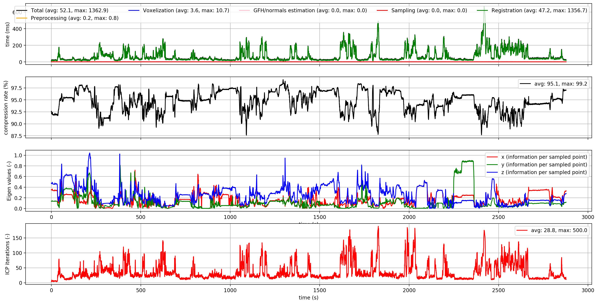
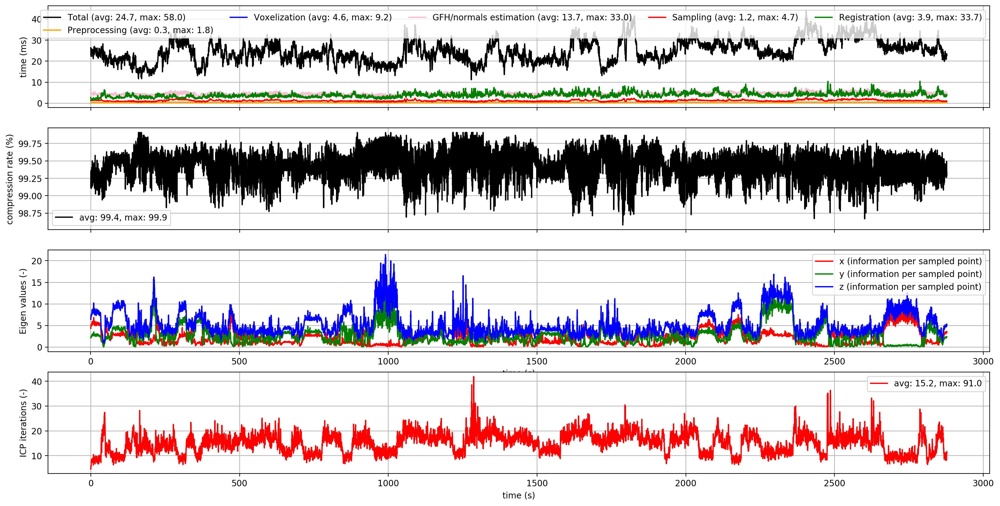
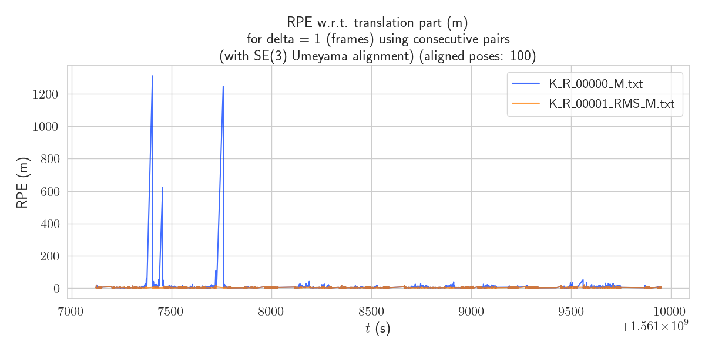
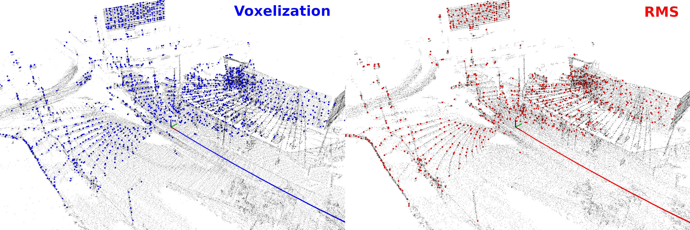

## MulRan: Sejong01

Experiment summary:
- Robot: car
- Sensor: Ouster OS1-64
- Odometry: KISS-ICP
- Trajectory length: 23 km
- Duration: 47 min
- Mean speed: 12.4 m/s
- Max speed: 20.3 m/s
- Results below comptued on: AMD Ryzen 7 PRO 4750U

Graphs' legend from top to bottom:

- timing (better: higher)
- compression (better: higher)
- per-point information in the optimization (better: higher)
- \# of ICP iterations till convergence (better: lower)

### Pure KISS-ICP
Results: Unstable with a lot of redundancy in the data.

### KISS-ICP preceded by RMS
Results:
Low and stable timing+compression, which effectively lowers the \# of ICP iterations (registration time lowered 12 times on average!).
High level of information preserved.

### APE and RPE comparison
Graphs: 
- blue: KISS-ICP
- orange: KISS-ICP preceded by RMS

Results: High drift reduction by RMS.

#### APE

| Sampling method | RMSE (m)      | mean (m) | median (m) | max (m) |
| -------------   | ------------- | -------- | ---------- | ------- |
| Voxelization    | 7100          | 6511     | 7815       | 9581    |
| RMS             | 2230          | 1953     | 2352       | 3292    |

#### RPE

| Sampling method | RMSE (m)      | mean (m) | median (m) | max (m) |
| -------------   | ------------- | -------- | ---------- | ------- |
| Voxelization    | 17.9          | 4.3      | 2.7        | 1311.6  |
| RMS             | 3.1           | 2.9      | 2.6        | 21.6    |

### Example sampling of a single frame

